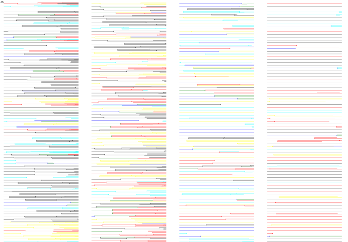

---
title: A lineage tree-based hidden Markov model to quantify cellular heterogeneity
keywords:
- cancer
- heterogeneity
- lineage
- hidden Markov model
lang: en-US
date-meta: '2021-01-30'
author-meta:
- Shakthi Visagan
- Farnaz Mohammadi
- Sean M. Gross
- Luka Karginov
- JC Lagarde
- Laura M. Heiser
- Aaron S. Meyer
header-includes: |-
  <!--
  Manubot generated metadata rendered from header-includes-template.html.
  Suggest improvements at https://github.com/manubot/manubot/blob/master/manubot/process/header-includes-template.html
  -->
  <meta name="dc.format" content="text/html" />
  <meta name="dc.title" content="A lineage tree-based hidden Markov model to quantify cellular heterogeneity" />
  <meta name="citation_title" content="A lineage tree-based hidden Markov model to quantify cellular heterogeneity" />
  <meta property="og:title" content="A lineage tree-based hidden Markov model to quantify cellular heterogeneity" />
  <meta property="twitter:title" content="A lineage tree-based hidden Markov model to quantify cellular heterogeneity" />
  <meta name="dc.date" content="2021-01-30" />
  <meta name="citation_publication_date" content="2021-01-30" />
  <meta name="dc.language" content="en-US" />
  <meta name="citation_language" content="en-US" />
  <meta name="dc.relation.ispartof" content="Manubot" />
  <meta name="dc.publisher" content="Manubot" />
  <meta name="citation_journal_title" content="Manubot" />
  <meta name="citation_technical_report_institution" content="Manubot" />
  <meta name="citation_author" content="Shakthi Visagan" />
  <meta name="citation_author_institution" content="Department of Bioengineering, University of California, Los Angeles" />
  <meta name="citation_author_orcid" content="0000-0001-9295-2188" />
  <meta name="citation_author" content="Farnaz Mohammadi" />
  <meta name="citation_author_institution" content="Department of Bioengineering, University of California, Los Angeles" />
  <meta name="citation_author_orcid" content="0000-0002-0197-4670" />
  <meta name="citation_author" content="Sean M. Gross" />
  <meta name="citation_author_institution" content="Department of Biomedical Engineering, Oregon Health and Science University, Portland" />
  <meta name="citation_author_orcid" content="0000-0002-9621-8551" />
  <meta name="citation_author" content="Luka Karginov" />
  <meta name="citation_author_institution" content="Department of Bioengineering, University of Illinois, Urbana Champaign" />
  <meta name="citation_author_orcid" content="0000-0002-2455-1558" />
  <meta name="citation_author" content="JC Lagarde" />
  <meta name="citation_author_institution" content="Department of Bioengineering, University of California, Los Angeles" />
  <meta name="citation_author_orcid" content="0000-0002-3738-3119" />
  <meta name="citation_author" content="Laura M. Heiser" />
  <meta name="citation_author_institution" content="Department of Biomedical Engineering, Oregon Health and Science University, Portland" />
  <meta name="citation_author" content="Aaron S. Meyer" />
  <meta name="citation_author_institution" content="Department of Bioengineering, University of California, Los Angeles" />
  <meta name="citation_author_institution" content="Department of Bioinformatics, University of California, Los Angeles" />
  <meta name="citation_author_institution" content="Jonsson Comprehensive Cancer Center, University of California, Los Angeles" />
  <meta name="citation_author_institution" content="Eli and Edythe Broad Center of Regenerative Medicine and Stem Cell Research, University of California, Los Angeles" />
  <meta name="citation_author_orcid" content="0000-0003-4513-1840" />
  <meta name="twitter:creator" content="@aarmey" />
  <link rel="canonical" href="https://meyer-lab.github.io/tHMM/" />
  <meta property="og:url" content="https://meyer-lab.github.io/tHMM/" />
  <meta property="twitter:url" content="https://meyer-lab.github.io/tHMM/" />
  <meta name="citation_fulltext_html_url" content="https://meyer-lab.github.io/tHMM/" />
  <meta name="citation_pdf_url" content="https://meyer-lab.github.io/tHMM/manuscript.pdf" />
  <link rel="alternate" type="application/pdf" href="https://meyer-lab.github.io/tHMM/manuscript.pdf" />
  <link rel="alternate" type="text/html" href="https://meyer-lab.github.io/tHMM/v/55f56a7d36bb00f341817bbdf004934bda4ac8a9/" />
  <meta name="manubot_html_url_versioned" content="https://meyer-lab.github.io/tHMM/v/55f56a7d36bb00f341817bbdf004934bda4ac8a9/" />
  <meta name="manubot_pdf_url_versioned" content="https://meyer-lab.github.io/tHMM/v/55f56a7d36bb00f341817bbdf004934bda4ac8a9/manuscript.pdf" />
  <meta property="og:type" content="article" />
  <meta property="twitter:card" content="summary_large_image" />
  <link rel="icon" type="image/png" sizes="192x192" href="https://manubot.org/favicon-192x192.png" />
  <link rel="mask-icon" href="https://manubot.org/safari-pinned-tab.svg" color="#ad1457" />
  <meta name="theme-color" content="#ad1457" />
  <!-- end Manubot generated metadata -->
bibliography: []
manubot-output-bibliography: output/references.json
manubot-output-citekeys: output/citations.tsv
manubot-requests-cache-path: cache/requests-cache
manubot-clear-requests-cache: false
...

<small><em>
This manuscript
was automatically generated on January 30, 2021.
</em></small>

## Authors

+ **Shakthi Visagan** 
    ORCID
    [0000-0001-9295-2188](https://orcid.org/0000-0001-9295-2188)
    · Github
    [shak360](https://github.com/shak360) 
  <small>
     Department of Bioengineering, University of California, Los Angeles
  </small>

+ **Farnaz Mohammadi** 
    ORCID
    [0000-0002-0197-4670](https://orcid.org/0000-0002-0197-4670)
    · Github
    [farnazmdi](https://github.com/farnazmdi) 
  <small>
     Department of Bioengineering, University of California, Los Angeles
  </small>

+ **Sean M. Gross** 
    ORCID
    [0000-0002-9621-8551](https://orcid.org/0000-0002-9621-8551) 
  <small>
     Department of Biomedical Engineering, Oregon Health and Science University, Portland
  </small>

+ **Luka Karginov** 
    ORCID
    [0000-0002-2455-1558](https://orcid.org/0000-0002-2455-1558)
    · Github
    [lkargi](https://github.com/lkargi) 
  <small>
     Department of Bioengineering, University of Illinois, Urbana Champaign
  </small>

+ **JC Lagarde** 
    ORCID
    [0000-0002-3738-3119](https://orcid.org/0000-0002-3738-3119)
    · Github
    [jclagarde](https://github.com/jclagarde) 
  <small>
     Department of Bioengineering, University of California, Los Angeles
  </small>

+ **Laura M. Heiser**  
  <small>
     Department of Biomedical Engineering, Oregon Health and Science University, Portland
  </small>

+ **Aaron S. Meyer** 
    ORCID
    [0000-0003-4513-1840](https://orcid.org/0000-0003-4513-1840)
    · Github
    [aarmey](https://github.com/aarmey)
    · twitter
    [aarmey](https://twitter.com/aarmey) 
  <small>
     Department of Bioengineering, University of California, Los Angeles; Department of Bioinformatics, University of California, Los Angeles; Jonsson Comprehensive Cancer Center, University of California, Los Angeles; Eli and Edythe Broad Center of Regenerative Medicine and Stem Cell Research, University of California, Los Angeles
  </small>

## Abstract {.page_break_before}

Cell plasticity, or the ability of cells within a population to reversibly alter epigenetic state, is an important feature of tissue homeostasis during processes such as wound healing and is dysregulated in cancer. Plasticity is further linked to other sources of cell-to-cell heterogeneity, or diversity in cell state, including genetic mutations and variation in signaling during drug-resistance development. Ultimately these processes prevent most cancer therapies from being curative. The predominant methods of quantifying tumor-drug response operate on population-level measurements and therefore lack evolutionary dynamics, which are particularly critical for highly dynamic processes such as plasticity. Here, we apply a tree-based adaptation of a hidden Markov model (tHMM) that employs single-cell lineages as input, to learn the characteristic patterns of single-cell heterogeneity and state transitions in an unsupervised fashion. This model enables single-cell classification based on the phenotype of individual cells and their relatives for improved specificity when pinpointing the molecular drivers of variability in drug response. Integrating this model with a modular interface for defining observed phenotypes allows the model to easily be adapted to any phenotype measured in single cells. We paired cell fate with either cell lifetimes or cell cycle phase lengths (G1 and S/G2) as our observed phenotypes on synthetic data and demonstrated that the model successfully classifies cells within experimentally-tractable dataset sizes. As an application, we analyzed experimental measurements of cell fate and phase duration in cancer cell populations to determine the number of distinct subpopulations. In total, this tHMM framework allows for the flexible classification of single-cell heterogeneity across lineages.

## Summary points

- A lineage tree-based hidden Markov model (tHMM) quantifies cell-to-cell variability and dynamic population changes.
- A modular interface to define phenotypes allows the model to work with a wide variety of measurements.
- The model accurately classifies cells within experimentally tractable dataset sizes.
- Classifying cells based on their phenotypic heterogeneity can uncover resistance mechanisms hidden at the population level.

## Author Summary

Heterogeneous traits, such as resistance or susceptibility to a drug, can be correlated in related cells because of partially inherited factors. These acquired traits may be the result of the microenvironment, epigenetics, or mutations. Using cell’s relationships we capture these dynamic transitions between different cell states and arrive at a more accurate quantification of cell heterogeneity within tumor populations. Our computational approach employing a modified hidden Markov model provides greater specificity by identifying intratumor resistance on a single cell level based on lineage histories and can identify dynamic changes in population structure upon treatment.

## Introduction

<!-- motivation; heterogeneity is an obstacle for chemotherapy  -->
One of the primary treatments of cancer consists of chemotherapy, mainly targeted therapies, whereby patients are administered drugs that eliminate fast-proliferating cells to stall cancer growth or eliminate the tumor. Long-term therapeutic efficacy, however, varies significantly due to the vast heterogeneity in intratumor response to therapy [@pmid:16129367; @PMID:20619739]. Cell variability in drug response can originate from cell-intrinsic factors, such as genomic alterations (i.e., altered nucleotide excision repair, telomere maintenance, and copy-number variation) and epigenetic mechanisms like changes in a chromatin state [@pmid:20371346], or cell-extrinsic factors such as spatial variability in the surrounding vasculature and environmental stressors [@doi:10.1038/nrg.2016.13; @pmid:25131830; @pmid:29250983]. Moreover, cell plasticity is observed more often in cancer cells where they take over the characteristics of other cell subttypes which could directly affect their sensitivity to the therapeutic compounds [@doi:10.1038/bjc.2015.146].

<!-- literature review in conventional single-cell variability studies -->
Advances in ‘omics’ technologies have enabled detailed analysis of cell-to-cell variability [@PMID:20619739; @pmid:22397650], and the development of fine mapping and protein network algorithms have determined the presence of causal genetic mutations and dysregulation events that drive abnormal protein function [@doi:10.1534/genetics.114.167908; @pmid:27322546]. These modalities, however, are labor and time-intensive, do not account for environmental factors, and serve primarily as end-point analysis barring longitudinal observation of tumor evolution. In addition to 'omics' modalities, genetic _association_ studies (i.e., Cancer Cell Line Encyclopedia) are similarly able to find common risk factors with smaller effect sizes using population-level samples. The findings are valuable but fail to identify rare and meaningful transitions on the single-cell level [@pmid:22460905], in particular the stochastic changes in individual cell states that have significant effects on overall tumor resistance. Lastly, fitness markers such as cell end-of-life fate, lifetime, and population doubling time are adopted in the clinical setting to measure cell pathologies [@doi:10.1038/ni908; @pmid:8072198; @pmid:8655369; @pmid:20981102]. Recent research has made efforts to track phenotypic measurements of fitness at the single-cell level [@pmid:29381859; @pmid:22886092]; however, most efforts are not yet resolved enough to illuminate the full complexity of cancer cells due in large part to reliance on population-level analysis (i.e., IC~50~) [@pmid:25421725].  

<!-- Lineage data is special -->
Measurements accompanied by lineage relationships are uniquely valuable for studying inherited phenotypes within families of people or populations of cells. This value is well-recognized in linkage studies which use pairs of relatives to identify the genetic determinants of disease [@pmid:19136655]. Notably, linkage studies can identify genetic determinants with greater power than even much larger correlation-based studies because relatives essentially serve as internal controls (CITE REVIEW). Linkage studies also start with the phenotype of individuals, rather than grouping based on molecular differences as is most common in cells. Lineage-resolved data has demonstrated unique value in cells for uncovering heterogeneity due to transient differences [@doi:10.1101/373258; @doi:10.1073/pnas.1715639115].

<!-- tHMMs are a solution to modeling lineage data -->
Hidden Markov models (HMMs) provide a strategy to infer discrete states from measurements when a series of co-dependent observations are made. An example of this is their most widely-used application—time series data—where each measurement is dependent on what came before. Recognizing this co-dependence allows HMMs to make accurate inferences even in the presence of extremely noisy measurements since each neighboring measurement can provide accumulating evidence for a prediction. HMMs have been adapted to lineage trees (tHMMs) so that each measurement across the tree can provide accumulating evidence for a prediction. Just like with time-series data, these models can provide very accurate predictions despite noisy measurements and limited information by recognizing the co-dependence between measurements [@doi:10.1109/78.668544; @doi:10.1109/TSP.2004.832006]. tHMMs have been used in a multitude of applications, from image classification to comparative genomics [@pmid:18255546; @pmid:23762278]. In cells, these models have been fit to lineages collected from stem cells and bacteria colonies [@PMID:19628503; @doi:10.1101/488981]. Improvements in cell tracking and high-throughput imaging promise to make these models valuable techniques for studying the plasticity of heterogeneous cell populations. However, widespread use will require usable implementations that can be readily adapted to different experimental measurements, examples of unique insights they can provide, and standards for experimental validation.

<!-- Introduction to the paper -->

Here, we develop a generic implementation of tHMMs with a defined interface for integrating diverse types of measurements on binary or cell lineage trees. We use this to analyze how populations of single breast cancer cells respond to therapy with a cell cycle reporter. Single-cell measurements of the cell cycle revealed extensive variation in drug response that is not captured in population-level measurement. This model allows us to quantify the dynamics and phenotypic features of heterogeneity in drug response. Furthermore, we are able to predict the most likely number of phenotypically distinct subpopulation, cell state distribution, transition probabilities from one state to another, and each cell's expected state. This work, therefore, provides a flexible phenotype-driven route to discovering cell-to-cell variation in drug response, demonstrates an overall strategy for quantifying the dynamics of cell heterogeneity, and implements a very general software tool for widespread use of tHMM models.

## Results

### Lineage information provides unique information about the source and dynamics of heterogeneity

To illustrate the unique value of lineage measurements when analyzing heterogeneous drug responses, we plotted a series of lineages from our measurements of the breast cancer cell line AU565 treated with gemcitabine (Fig. @fig:lineage). While there is a striking difference in the growth dynamics of individual cells, the total number of cells at any given time is nearly identical. As a result, population-level drug response measurements cannot distinguish these differences (CITE). Measurements that record the history of cells (e.g., CFSE staining, Luria-Delbruck experiment) can help to distinguish these two populations but must make assumptions about the dynamics of heterogeneity [@DOI:10.1073/pnas.1715639115; @PMID:28607484]. Lineage measurements, by contrast, provide sufficiently rich measurements to quantify the specific structure of heterogeneous response. By observing individual cells, a variety of phenotypic measurements such as inter-mitotic times, cell cycle phase durations, motility, cell death and division, morphology, and protein and transcription factor levels can be characterized in parallel (CITE).

{#fig:lineage}

### A lineage tree-based hidden Markov model infers the state of cells given measurements on lineage trees

Given the unique insights that single-cell measurements on lineage trees can provide, we wished to implement a strategy for classifying cells based on their phenotype and relationships. Given a set of measurements made across a lineage tree, we used a lineage tree-based hidden Markov model (tHMM) to fit these data (Fig. {@fig:tree}a). Like a typical hidden Markov model, a tHMM can infer the hidden discrete states of cells given a series of measurements. This takes place using an iterative strategy wherein the states of each cell are predicted given their phenotype and relatives (“expectation” step), and then each distribution of phenotypes is fit to match the cells within that state (“maximization” step) (Fig. {@fig:tree}b). This expectation-maximization (EM) process repeats until convergence.

After fitting, the model can provide a variety of information (Fig. {@fig:tree}c). First, it estimates the starting abundance of each state and the transition probabilities between them. Second, the phenotypes of cells in each state are estimated and can be compared to distinguish how cells of each state behave. The state of each cell can be predicted from the fit data or new measurements. Finally, the model provides a likelihood of each cell’s observations and therefore the data overall. This last quantity can be used, for example, to estimate the number of distinguishable cell states. When implementing these processes, we ensured that a cell’s measurements are defined through a modular interface, allowing other forms of data to be easily integrated.

![**The tHMM interface.** (a) Input data takes the form of single-cell measurements, where the lineage relationship between cells is known. (b) The fitting process includes expectation and maximization steps, where model parameters are iteratively updated until convergence. (c) Output predictions of the model after fitting including the tree of inferred cell states, probabilities of transition between each state, starting abundance of each cell state, and distributions that describe the behavior of cells within each state. The model likelihood can be used to estimate the number of distinguishable cell states.](figure2.svg){#fig:tree}

### Experiments of finite time necessitate experimental censorship corrections

Modeling cell growth and therefore the duration of each cell’s lifetime is complicated by the influence of experimental factors. Specifically, cells at the beginning or end of an experiment persist beyond its duration and so, while we observe them, we do not know the duration of their cell cycle phases. Previously, this has been addressed by simply removing incompletely-observed cells [@doi:10.7554/eLife.51002]. However, doing so results in a systematic bias, where longer-lived cells are preferentially eliminated. On the other hand, treating these truncated values like they were not truncated also creates a systematic bias; for example, the experiment duration would become an upper bound on the cells' lifetimes.

To incorporate this effect into our model, we marked cells or their specific cell cycle phase that encountered the bounds of the experiment as such. When estimating the properties of a cell’s lifetime or the probability of a cell’s observation, these cells instead used a censored estimator or the survival function of the distribution (CITE). Using synthetic data, we verified that this correction resulted in accurate phenotype estimations (Fig. @fig:censor). As exhibited, using the censored estimator as opposed to the uncensored model on incompletely-observed cells results in higher cell state assignment accuracy. Thus, taking into account the cells that outlive the bounds of the experiment through a censored model ensures that we can accurately infer cell states despite the contribution of experiment duration.

![**Experiments of finite time necessitate data censorship corrections.** (a) An example, randomly-generated, uncensored two-state lineage. (b) An example, randomly-generated, censored two-state lineage. State 0 and 1 cells are shown in different colors. (c) State assignment accuracy with censored lineages using an uncensored model. (d) State assignment accuracy with experiment time- and cell death-censored lineages. Each scatter point represents the state assignment accuracy of a lineage with the shown cell number that has been fitted to the model.](figure4.svg){#fig:censor}

### Synthetic lineage benchmarks show a tHMM can accurately estimate population behavior

To evaluate how accurately a tHMM model could infer the behavior of multi-state cell populations, we used synthetic populations of cells in a wide variety of configurations. In each case, we determined that our implementation of a tHMM model could accurately infer the hidden states and parameters of a population given roughly 100 cells. This synthetic data included situations that were both not censored (Figs. @fig:uncenSingle, @fig:uncenMulti, @fig:performUncenSingle, @fig:performUncenMulti) and censored due to cell death and experimental duration to be a valid representative of experimental lineages (Figs. @fig:performSyn, @fig:performCenMulti, @fig:cenMulti). In addition to varying the number of cells in a population, we benchmarked populations with varied cell state percentages (Figs. @fig:prop4, @fig:real_5) and varied degrees of phenotypic differences (Figs. @fig:wass1, @fig:wass2, @fig:wass). In total, this benchmarking showed that our tHMM model would provide accurate results across a range of circumstances.

More specifically, one of the benchmarking studies we performed was with data matching our measurements of AU565, where G1 and S/G2 phase periods were quantified (Fig. {@fig:performSyn}a). Although the tHMM model was fit with no information about the true underlying parameters of the simulated cells, it accurately distinguished the two underlying cell states' phenotypes (Fig. {@fig:performSyn}b–d) and member cells (Fig. {@fig:performSyn}e). On the population level, the transition and starting probabilities were accurately estimated (Fig. {@fig:performSyn}f–g). Thus, we are confident that, with similar experimental data, we should derive accurate results.

![**Model performance on censored lineages of increasing breadth and depth.** (a) Two-state populations of increasing breadth (increasing number of initial cells and therefore lineages) and of increasing depth (increasing experiment time) are analyzed. The states are shown in green and blue colors and red shows cell death. The model performance is shown based on (b) state assignment accuracy, (c) the error between the estimated and the true transition rate matrix and the (d) initial probability vector. Note that the Wasserstein distance between the true and estimated distributions for each state is much lower than the distance for two distributions that are quite similar (Fig. {@fig:wass}b). In (e-f) it shows the accuracy in estimating the Bernoulli parameters for G1 and S/G2 phase, respectively, and (g) depicts the distance between the true and estimated Gamma distributions associated with phase lengths for the two states. Each point in the scatter plots represents the estimated value for a lineage with the number of cells shown in the x-axis. The solid lines are the linear regressions for the scatter points.](figure5.svg){#fig:performSyn}

### Lineage information improves cell state identification for heritable phenotypes

Cells of even very distinct molecular states can have partly overlapping phenotypes due to non-heritable variation. Therefore, we sought to evaluate how different two states would need to be for us to accurately identify them as distinct (Fig. {@fig:wass}a). We varied the G1 phase duration of two states from identical to very distinct (Fig. {@fig:wass}b) and quantified the accuracy of our model. While the phenotypic observation of a given state had to be different for our model to accurately assign cells, even partly overlapping phenotypes could be distinguished by using the lineage relationships of cells (Fig. {@fig:wass}c). As a baseline comparison, we used K-means clustering to cluster cells based on their phenotype without using their lineage relationships (Fig. {@fig:wass}c). A tHMM consistently out-performed this approach.  The model performance in censored and uncensored populations were similar (Fig. @fig:wass1, @fig:wass2). This shows that the heritability of a cell state can help to more accurately identify cells with partially overlapping phenotypes.

![**Model performance versus the Wasserstein distance between states.** (a) Cartoon of how two states can vary in their phenotypic similarity. On the left, cells might be virtually indistinguishable (here based on shape). On the right, they might be so different that looking at one cell is sufficient to identify its state. (b) The distribution of G1 duration is varied in state 1 (blue) while the other state is kept constant. (c) State assignment accuracy versus the Wasserstein distance between state phenotypes. Each point represents the accuracy of state assignment for a lineage created by a set of parameters that yield the shown Wasserstein distance between the two state distributions. Either a k-means model was used with the phenotypes of each individual cell (orange) or the full tHMM model was applied (blue). The solid lines show a Lowess trendline of the model accuracy.](figure6.svg){#fig:wass}

### Likelihood-based model selection can effectively identify the number of distinct states

One does not usually know the number of distinct cell states within a population. Further, the number of distinct states may depend on the environmental context of the cells, particularly because we use phenotypic measurements (CITE). To test whether we could infer the number of phenotypically-distinct states, we performed model selection using the Akaike information criterion (AIC) while varying the number of states (Fig. @fig:sAIC). The predicted number of cell states was predominantly correct, and incorrect predictions still centered around the true answer, for both uncensored and censored lineages (Fig. @fig:sAIC). This indicated that model selection can help to identify the appropriate number of cell states for a given set of measurements.

{#fig:sAIC}

### tHMM infers multiple distinct subpopulations in experimental drug response data

We used phenotypic measurements of the G1 and S/G2 phase durations and fates in AU565 cells upon gemcitabine and lapatinib treatment as an application of our model. Cells were imaged every 30 minutes for 96 hours and then tracked over time to assemble their lineage relationships. First, we determined the number of distinct states the model inferred within these populations.The model was fit to the drug treatment data across all conditions, holding the initial and transition probabilities constant across concentration but allowing the phenotype emissions to independently vary in each condition. Using the Akeike information criterion as a model selection metric, the tHMM model inferred different numbers of distinct states for each drug (Fig. {@fig:expAIC}a-b).

{#fig:expAIC}

### tHMM infers fairly stable subpopulations for lapatinib-treated data

To visualize the properties of the states that the model has identified, we plotted the distribution of average phase-specific time duration for each state and each condition. Figs. {@fig:emissionsLPT}a-d accompanied with the transition probability plot (Fig. {@fig:emissionsLPT}i) show that treatment with lapatinib leads to three fairly stable states. As expected, lapatinib mostly influences G1 phase where it extend the duration of this phase in all states (Fig. {@fig:emissionsLPT}e) and leaves G2 progression rates almost unchanged (Fig. {@fig:emissionsLPT}f). This fact could be also observed in Figs. {@fig:emissionsLPT}a-d where green scatters that show cells in G1 phase, cover a wider range and could be as long as 120 hours and more, but G2 phase lengths are mosly condensed centered at ~30-50 hours long. Figs. {@fig:emissionsLPT}g-h show that mostly G1 cell death happens in state 2 and 3, but death in G2 phase is observed as well, in state 1.

![**State-specific emissions of the lapatinib-treated data.** (a-d) Distribution of phase lengths for each state and for each condition in lapatinib-treated cells (control, 25 nM, 50 nM, and 250 nM). Increasing the concentration of lapatinib results in more extension of G1 phase of cells, shown in green scatter points. (e-f) G1 and G2 phase progression rates for different concentrations. Most effects of lapatinib treatment is observed in G1 phase. (g-h) G1 and G2 division probabilities for different concentration. (i) State transition graph showing the probability of state transitions among the three predicted states. Arrows and the corresponding number on top of it shows the transition probability between the two states.](figure11.svg){#fig:emissionsLPT}

### Gemcitabine treatment leaves stable and cycle states in the cell population

Increasing the concentration in gemcitabine-treated trials shows a trend of extension and cell death in both phases, especially in G2 (Figs. {@fig:emissionsGMC}a-d). Figs. {@fig:emissionsGMC}e-f show that phase progression in G1 is only evident when the concentration is very high, but cells in all three states have a decline in their G2 progression rate for every concentration. Division probability is shown in Figs. {@fig:emissionsGMC}g-h where we see G1 cell death more significantly in state 1, and G2 cell death in state 2 and 3. From the transition graph (Fig. {@fig:emissionsGMC}i) states 2 and 3 form a cycle while state 1 is fairly stable. Cells in state 1 seem to be slower in G1 progression in any concentration, and have higher G1 cell death probability in the highest concentration. On the other hand, although cells in state 3 have higher probability of cell in G2, but due to the high inward transition probability from state 2, they are not depleted in G2. 

{#fig:emissionsGMC}

## Discussion

The model classified all types of synthetic populations of 2 true states with the accuracy higher than 90% for a minimum of ~50 cells in the population. In the cases with fewer number of observation types the accuracy reached almost 100%, however, slightly less accurate with phase-specific observations. The model showed relatively high sensitivity to the populations with under-represented sub-populations and proved efficacious with more distinct state features. Particularly in comparison to K-means clustering algorithm, the average accuracy of state assignment was higher by $15%$. Missing information in the form of time censorship did adversely affect the performance, however, we were able to handle the influence to be minimum. The model selection validated by AIC metric asserted the reliability of tHMM in predicting the most likely number of states within a population.

There are some lineages, however, on which the tHMM performed poorly, in particular lineages with less than 5 cells when they are evaluated for more than 3 states. Also, the model is dependent on the distance between the existing states and may perform poorly when the states are close or when the susceptible cells possessed high variance in parameter estimation. The deviations are also seen in the resistant cells, as some of the exponential estimates were orders of magnitude higher than the true value. The Gamma estimator, similar to any other lifetime distribution, suffered from survivorship bias due to removal of unfinished cells that were still alive at the end of the tracking period. Specifically, cells with longer lifetimes (i.e. higher growth rate) are more likely to live beyond the tracking period. We separated the censored and fully observed values and handled the censored values using a survival function. This unavoidable phenomenon, if not properly handled, could lead to the growth rate parameter approaching a value less than the true value and biased estimation. Although Bernoulli estimations are centered around their respective true values, they suffer from survivorship bias as well because cells with higher Bernoulli parameter divide more often and thus have a higher sample size for prediction. This leads to the resistant cell line possessing more accurate Bernoulli estimations relative to the susceptible subpopulation.

The tHMM accuracy performs maximum likelihood estimation using cell observations from each lineage in the population. Thus, the improved performance accuracy and decrease in its variance as lineage number increases validates the model architecture. Parameter estimation and initial and transition probability matrix estimations were accurate in most cases of synthetic data and the tHMM was able to better distinguish the separate subpopulations as more lineages were added. Furthermore, the model operates equally well whether the population of interest owns a pre-existing phenotypic heterogeneity or the cells acquire diverse phenotypes as a result of drug treatment.

In this work, we present a machine learning pipeline, the tHMM, that can analyze tree-structured data using any measurements from the parent and daughter nodes. In particular, we apply our algorithm to a cell imaging protocol that inputs cell fate and G1 and S/G2 phase lengths into the tHMM pipeline and can be used with time-lapsed images for real-time classification. The tHMM is able to construct and analyze cell lineage trees to properly assign cells to different states based on virtually any number of phenotypic properties of cell fitness (in the case of our data, three), and also quantify the likelihood of transitioning to a different state using emissions and the transition rate matrix. Utilizing the AIC metric, the model predicted 3 and 4 distinct subpopulations for lapatinib and gemcitabine-treated data, respectively. We are designing assays to experimentally validate the number of states predicted by tHMM. The current version of this pipeline is most accurate when populations consist of at least 50 cells per lineage. Cell transitions from therapy-susceptible to therapy-resistant states are well detected by the model, which will prove useful for identifying mutant subtypes in tumors and leading to more optimal therapies for cancer treatment. The tHMM may further be used for drug screening as a single-cell, rather than population-based, means of quantifying the potency of novel therapies in eliminating all subpopulations within a tumor. The pipeline will provide researchers and clinicians with an improved classification of heterogeneity among cells, or any other tree-structured data, and provide information about latent changes in cellular identity.

## Materials and Methods

### Lineage tree-based hidden Markov model

The core assumption of a Markov chain is that the next state and current observation are only dependent on the current state. Proof of many of the expressions below can be found in Durand et al [@doi:10.1109/TSP.2004.832006]. The tHMM is composed of several intermediate steps to carry out predictions and estimations.

#### Basic model structure

The initial probabilities of a cell being in state $k$ are represented by the vector $\pi$ that sums to 1:  
$$\pi_k = P(z_1 = k), \qquad k \in \{1, ..., K\}$$  
where $z$ shows the states and $K$ is the total number of states. The probability of state $i$ transitioning to state $j$ is represented by the $K \times K$ matrix, $T$, in which each row sums to 1:   
$$T_{i,j} = T(z_i \rightarrow z_j) = P(z_j \;| z_i), \qquad i,j \in \{1, ..., K\}$$  
The emission likelihood matrix, $EL$, is based on the cell observations. It is defined as the probability of an observation conditioned on the cell being in a specific state:  
$$EL(n,k) = P(x_n = x | z_n = k)$$
where $x_n$ shows the cell number $n$, with a total of N cells in a lineage.
Separate observations were assumed to be independent; for instance, cell fate is considered to be independent from the time duration of each cell phase. This faciliatates calculating the likelihood of observations, such that we multiply the likelihood of all observations together for the total likelihood. Since the hidden states are unobserved, we need an expectation-maximization (EM) algorithm, in this case we call it Baum-Welch algorithm, to find the states and their specifications. EM algorithm consists of two steps: (1) the expectation step (E-step) and (2) maximization step (M-step.) In the E-step, given the whole lineage tree the probability of a cell and its parent being in specific states are calculated, such that for every cell and every state we have $P(z_n = k \;| X_n) \label{E1}$ and $P(z_n = k,\; z_{n+1} = l \; | X_n) \label{E2}$. The E-step is calculated by the upward and downward recursion algorithms.

In the M-step, distribution parameters of each state and hyper parameters such as the initial ($\pi$) and transition probability ($T$) matrices are calculated, given the estimated states of each cell. In each run, we switch between the E-step and the M-step and calculate the likelihood. If the likelihood stops improving, the process stops and exists the algorithm, which means convergence has been reached. The following explains each step in detail.

#### E-step
##### Upward recursion

An _upward-downward_ algorithm for calculating the probabilities in hidden Markov chains (HMCs) was previously proposed by Erphaim and Merhav [@doi:10.1109/TIT.2002.1003838] which suffered from the underflow problem. This problem was originally solved by Levinson [@doi:10.1002/j.1538-7305.1983.tb03114.x] for HMCs, where they adopted a heuristic based scaling, and then was upgraded by Devijver et al., [@doi:10.1016/0167-8655(85)90023-6] where they introduced smooth probabilities. Durand et al., [@doi:10.1109/TSP.2004.832006] however, revised this approach for hidden Markov trees to avoid underflow when calculating $P(Z|X)$ probability matrices. To explain that, we need to know the following definitions:

- $p(n)$ is noted as the parent cell of the cell $n$, and $c(n)$ is noted as children of cell $n$.
- $\bar{X}$ is the observation of the whole tree and $\bar{X}_a$ is a subtree of $\bar{X}$ which is rooted at cell $a$.
- $\bar{Z}$ is the complete hidden state tree.
- $\bar{X}_{a/b}$ is the subtree rooted at $a$ except for the subtree rooted at cell $b$, if $\bar{X}_b$ is a subtree of $\bar{X}_a$.

For the state prediction we start by calculating the marginal state distribution (MSD) matrix. MSD is an $N \times K$ matrix that for each cell is marginalizing the transition probability over all possible current states by traversing from root to leaf cells:  
$$MSD(n,k) = P(z_{n} = k)= \sum_{i} P(z_n = k |z_{n-1} = i)\times P(z_{n-1} = i)$$

During upward recursion, the flow of upward probabilities is calculated from leaf cells to the root cells generation by generation. For leaf cells, the probabilities ($\beta$) are calculated by:  
$$\beta(n,k) = P(z_n = k\;|X_n = x_n) = \frac{EL(n,k) \times MSD(n,k)}{NF_l(n)}$$

in which $X_n$ is the leaf cell's observation, and NF (Normalizing Factor) is an $N \times 1$ matrix that is the marginal observation distribution. Since $\sum_{k} \beta_n(k) = 1$, we find the NF for leaf cells using:  
$$NF_l(n) = \sum_{k} EL(n,k) \times MSD(n,k) = P(X_n = x_n)$$

For non-leaf cells the values are given by:  
$$ \beta(n,k) = P(z_n = k\;|\bar{X}_n = \bar{x}_n) = \frac{EL(n,k) \times MSD(n,k) \times \prod_{v \in c(n)}\beta_{n,v}(k)}{NF_{nl}(n)}$$

where we calculate the non-leaf NF using:  
$$NF_{nl}(n) = \sum_{k} \Big[EL(n,k) \times MSD(n,k) \prod_{v \in c(n)} \beta_{n,v}(k)\Big]$$

and linking $\beta$ between parent-daughter cells is given by:  
$$ \beta_{p(n), n}(k) = P(\bar{X}_n = \bar{x}_n | z_{p(n)} = k) = \sum_{j} \frac{\beta_n(j) \times T_{k,j}}{MSD(n,j)}$$

By recursing from leaf to root cells, the $\beta$ and NF matrices are calculated as upward recursion. The NF matrix gives a convenient expression for the log-likelihood of the observations. For each root cell we have:

$$P(\bar{X} = \bar{x}) = \prod_{n} \frac{P(\bar{X}_n = \bar{x}_n)}{\prod_{v\in c(n)} P(\bar{X}_v = \bar{x}_v)} = \sum_{n} NF(n) \qquad n \in \{1, ..., N\}$$

The overall model log-likelihood is given by the sum over root cells:

$$log P(\bar{X} = \bar{x}) = \sum_{n} log NF(n)$$

This quantity acts as the convergence measure of the EM algorithm.

##### Downward recursion

For computing _downward recursion_, we need the following definition for each root cells:

$$ \gamma_1(k) = P(z_1 = k | \bar{X}_1 = \bar{x}_1) = \beta_1(k)$$

The other cells follow in an $N \times K$ matrix by writing the conditional probabilities as the summation over the joint probabilities of parent-daughter cells:

$$\gamma_n(k) = P(z_n = k | \bar{X}_1 = \bar{x}_1) = \frac{\beta_n(k)}{MSD(n,k)} \sum_{i}\frac{T_{i,k} \gamma_{p(n)}(i)}{\beta_{p(n),n}(i)}$$

##### Viterbi algorithm

Given a sequence of observations in a hidden Markov chain, the Viterbi algorithm is commonly used to find the most likely sequence of states. Equivalently, here it returns the most likely sequence of states of the cells in a lineage tree using upward and downward recursion [@doi:10.1109/TSP.2004.832006].

Viterbi follows an upward recursion from leaf to root cells. We define $\delta$, an $N \times K$ matrix:

$$\delta (n,k) = \max\limits_{\bar{z}_{c(n)}}\{P(\bar{X}_n = \bar{x}_n, \bar{Z}_{c(n)} = \bar{z}_{c(n)} | z_n = j)\}$$

and the links between parent-daughter cells as:

$$\delta_{p(n),n}(k) = \max\limits_{\bar{z}_n} \{P(\bar{X}_n = \bar{x}_n, \bar{Z}_n = \bar{z}_n | z_{p(n)} = j)\} = \max\limits_{j}\{\delta(n,j) T_{k,j}\}$$

We initialize from the leaf cells as:

$$\delta(n,k) = P(X_n = x_n | z_n = k) = EL(n,k)$$

and for non-leaf cells use:

$$\delta(n,k) = \Big[\prod_{v \in c(n)} \delta_{n,v}(k)\Big]\times EL(n,k)$$

The probability of the optimal state tree corresponding to the observations tree, assuming root cell is noted as cell 1, is given by:

$$Z^* = \max\limits_{k}\{\delta(1,k) \pi_k \}$$

which arises from maximization over the conditional emission likelihood (EL) probabilities by factoring out the root cells as the outer maximizing step over all possible states.

#### M-step

In the M-step, we find the maximum likelihood of the parameters corresponding to the hidden Markov model. Here, we estimate $\theta = (\pi, T, p, a, s)$ the initial and transition probability matrices, the parameters of the observation distributions, i.e., division probability from the Bernoulli distribution, and shape, and scale parameters of the Gamma distribution. We do so by maximizing the joint probability of the observations and states given the parameters from the previous step; in other words $\theta^* = \max\limits_{\theta} P(Z, X|\theta)$ where $\theta$ refers to the parameters estimated in the previous step. We define a probability $\xi_n(j,k) = P(Z, X|\theta)$. According to Bayes theorem we can write that as $P(Z|X,\theta) \times P(X|\theta)$ and since $P(\bar{X}_1 = \bar{x}_1$ | \theta) is the emission likelihood probabilities of the whole tree, it is just a constant coefficient and we can ignore it. Writing $P(Z|X,\theta) as a joint probability, we have:
$$ \xi_n(j,k) = P(z_n = j, z_{p(n)} = k | \bar{X}_1 = \bar{x}_1)$$
which is equivalent to: 
$$ \xi_n(j,k) = \frac{\beta(n+1, k) \times T_{j,k} \times \gamma_j(n)}{MSD(n+1, k) \times \beta_{p(n),n}(j)}$$
The maximum likelihood estimation of the initial probabilities:  
$$ \pi^*_k = \gamma_1(k)$$
The transition probability matrix would be estimated as:  
$$ T^*_{i,j} = \frac{\sum_{n=1}^{N-1} \xi_n(i,j)}{\sum_{n=1}^{N-1} \gamma_n(i)} $$

To estimate the distribution parameters after finding the most likely state for each cell, we group them and group their observations based on their estimated state and calculate their maximum likelihood estimation. The experimental data includes measurements of cell fate and G1 and S/G2 phase lengths for lapatinib treatement with 25 nM, 100 nM, and 250 nM and for gemcitabine treatment with 5 nM, 10 nM, and 30 nM. By fitting the lineage data of each condition we would get a set of estimated parameters for the distribution of phase lengths and fate for each cell state. For estimating the Bernoulli parameter we simply find the sample mean of the observations for each state. Assuming we have $N_1$ data points estimated in state 1, the corresponding Bernoulli parameter for state 1 would be:

$$ p^*_1 = \frac{\sum_{i=1}^{N_1} x_b(i)}{N_1}$$

And for Gamma distribution parameters we use a closed-form estimation based on \cite{gamma_estimation} which has been corrected for bias:  
$$ a^* = \frac{N_1 \times  \sum_{i=1}^{N_1} x_g(i)}{\Big[N_1 \times \sum_{i=1}^{N_1} x_g(i) ln(x_g(i))\Big] - \sum_{i=1}^{N_1} ln(x_g(i)) \times \sum_{i=1}^{N_1} x_g(i)} $$
$$ s^* = \frac{1}{N_1^2} \times \Big[N_1 \times \sum_{i=1}^{N_1} x_g(i) ln(x_g(i)) - \sum_{i=1}^{N_1} ln(x_g(i)) \times \sum_{i=1}^{N_1} x_g(i) \Big]$$

The shape and scale parameter from the gamma-distributed phase lengths are representations of the number of and the progression rate through the sub-phases, and since all the data is collected from one specific cell line, we assumed the number of sub-phases do not change from one condition to another. Hence, to look at the pattern of parameter change across different conditions, we decided to fit all the conditions simultaneously instead of one by one, to fix the shape parameter across different conditions. On the other hand, the pattern by which cells respond to a drug treatment, should be monotonic by increasing the drug concentration. For instance, we except to have a decreasing progression rate through G1 phase from control condition to 25 nM, to 100 nM, to 250 nM of lapatinib treatment. To apply this assumption, we forced the scale parameters in both phases to be in a decreasing order across different conditions when all the conditions are being fitted at once. For that, we used linear constrained fitting using "trust-constr" method in scipy.optimize package in Python.

### Synthetic lineage data

We generated synthetic lineage trees with $K$ discrete states and $N$ total number of cells for benchmarking. Lineages were composed of two primary data structures, the state and emissions trees. The state tree was randomly seeded with a root cell determined by the starting probabilities, then expanded by randomly sampling transitions based on the transition probability matrix. After creating the state tree with the desired number of cells, the emission tree is built upon it. Emissions were randomly sampled from the distributions for each cell’s state. Finally, the effects of the emissions were applied to the tree when necessary. If any cells died, their progeny were marked as unobserved by making their emissions NaN values. If applicable, the effects of finite-duration experiments were also applied. Cells existed outside of the experiment duration were similarly marked as unobserved, and those crossing the bounds of an experiment were marked as censored.

### Experimental single-cell lineage data

The data includes AU565 breast cancer cell line for control condition along with 7 concentrations of 2 types of targeted or chemotherapy compounds including lapatinib and gemcitabine. A fluorescent reporter was developed to translocate between the nucleus and cytoplasm to indicate the phase of the cells. Each cell is indicated as being in G1 or S/G2 phase according to the location of the reporter. When the reporter is located in the nucleus it means the cell is in G1 and when the reporter in the cytoplasm, the cell is passing through S/G2 phase. Each experiment lasts for 96 hours where the plates were being imaged every 30 minutes and each experiment was repeated three times. Single cells were manually tracked to collect cell fate in either phase or the amount of time it takes for each cell to pass through G1 and S/G2 phases.

#### Strategies to overcome model fitting to censored data

In single-cell experimental data collection, the lineages are almost never fully observed, in other words, we experience missing data for cells with time or fate censorship. Those leaf cells living at the end of the collected lineage trees, which may have been in their G1 or S/G2 exactly when the experiment was finished, experience a right-censorship, meaning, we have missing data from the future. For a cell that was in G1 at the end of the experiment, the time that the cell transitions to S/G2 is unknown, hence the cell's G1 is censored. In a similar way, almost all of the root cells appearing at the very beginning of the experiment are left-censored. This way, given a population of cells, we identify whether any of the cell's observations are censored or not. The uncensored values are passed to the estimator while the censored values will be handled by the survivor function. 
Another similar challenge is the unobserved measurements when cells die and their descendants disappear or when a leaf cell reaches the experiment end time while it is in the G1 phase such that the S/G2 phase for this cell is unobserved. We simply remove those measurements that have not been observed at all.

### Model evaluation

In this part we briefly mention the measures we used to quantify the model goodness-of-fit.

To find the most likely number of states corresponding to the observations, Akaike Information Criterion (AIC) is used [@doi:10.1006/jmps.1999.1276]. Degrees of freedom: Our model estimate a $k \times 1$ initial probability matrix, a $k \times k$ transition matrix, and a $k \times m$ matrix of state-wise parameters where $k$ is the number of states and $m$ is the number of parameters associated with observation distributions. For the phase-specific observation sets we have a total of 6 parameters including 2 Bernoulli parameters and 2 pairs of shape and scale parameters for Gamma distribution. Since the row-sums for transition and initial probability matrices must be 1, these values are not independent.

From distribution analysis of the phase lengths, we realized the shape parameter of the Gamma distribution remains fairly constant over different conditions, while the scale parameter changes. Hence, the shape parameter is shared between the set of populations that are treated with 4 different concentrations of the same compound. In each of these conditions, will have 2.25 number of free parameters (1 Bernoulli parameter, 1 scale parameter, and 1/4 shape parameter). With these considerations, for each state the number of free parameters while phase-specific observations will be 4.5. Ultimately, the degrees of freedom will be $k \times (k - 1) + (k - 1) + k * 4.5 $.
 
The Wasserstein or Kantorovich–Rubinstein metric is a measure of distance between two distributions. This metric was used to determine the difference between state emissions [@doi:10.1137/1118101]. An analytical solution, the absolute value of the difference in distribution means, was used for the Gamma distribution.

### Model benchmarking

In this model, we use multivariate emission distributions to represent the physical characteristics of the cells within the lineages. To create our synthetic data we considered two possible options as our set of observations throughout an experiment. First, cell fate and cell lifetime, and second, phase-specific fate and time duration, for which we used Bernoulli and Gamma distributions. For the consistency of our model, we set a specific set of parameters for those mentioned distributions in each case. The following is the collection of distribution parameters for two-state synthetic data.

#### Phase non-specific observations
The parameters are reflective of fitting the model to data of 5 nM lapatinib treatment. Figures @fig:prop4, @fig:real_5, @fig:performUncenSingle, @fig:performUncenMulti, and @fig:performCenMulti are based on these parameters.

| State | Bern p | Shape | Scale |
| :---: |  :---: | :---: | :---: |
|State 1 | 0.99 | 8 | 6 |
| State 2 | 0.75 | 8 | 1 |

#### Phase-specific observations

The data in Figures @fig:censor, @fig:performSyn, @fig:uncenSingle, @fig:uncenMulti, and @fig:cenMulti was created based on the following parameters. These parameters are based on estimations from AU565 cells treated with 5 nM lapatinib.

| State | Bern $G_1$ | Bern $G_2$ | Shape $G_1$ | Scale $G_1$ | Shape $G_2$ | Scale $G_2$ |
| :---: | :---: | :---: | :---: | :---: | :---: | :---: | 
| State 1 | 0.99 | 0.95 | 8 | 7 | 4 | 2 |
|State 2 | 0.95 | 0.9 | 6 | 4 | 3 | 5 |

#### Distant emissions

To create synthetic data with subpopulations of varying dissimilarity (Fig. @fig:wass), we use the phase-specific parameters set except that the values for the G1 phase Gamma shape parameter for state 1 is varied between $[4, 12]$. This results in an increase in the Wasserstein distance between the two cell states, allowing us to measure state assignment accuracy for different dissimilarity amounts between the two states. Likewise, for Figures @fig:wass1 and @fig:wass2, we simulated the overall cell lifetime duration and varied the Gamma distribution scale parameter from 1 to 8 for state 1.

#### Emissions for AIC figures

Figure @fig:sAIC uses a unique set of values for the emissions matrix in order to simulate varying states for the AIC calculation. 

| State | Bern $G_1$ | Bern $G_2$ | Shape $G_1$ | Scale $G_1$ | Shape $G_2$ | Scale $G_2$ |
:---: | :---: | :---: | :---: | :---: | :---: | :---: | 
| State 1 | 0.99 | 0.9 | 10 | 2 | 10 | 2 |
|State 2 | 0.9 | 0.9 | 20 | 3 | 20 | 3 |
| State 3 | 0.85 | 0.9 | 30 | 4 | 30 | 4 |
| State 4 | 0.8 | 0.9 | 40 | 4 | 40 | 5 |

## Acknowledgements

This work was supported by U01-CA215709 to A.S.M. **Competing financial interests:** The authors declare no competing financial interests.

## Author contributions statement

A.S.M. and L.M.H. conceived of the study; A.S.M. conceived of the model; A.S.M, F.M., S.V. designed model; A.S.M., F.M., J.L., L.K., S.V. performed computational experiments; S.M.G. performed the experiments; F.M., J.L., L.K., S.M.G. conducted data analysis; A.S.M. and L.M.H. supervised the research; all authors wrote the paper.

## Supplementary Figures {.page_break_before}

### Performance on an uncensored single lineage of increasing size

![**Performance on an uncensored single lineages of increasing size.** (a) Visual representation of cells increasing lineage size with varying states. (b) The Bernoulli parameter for states 1 and 2 as the number of cells increase. (c)-(d) The cell duration Gamma distribution shape, k, and scale, θ, for states 1 and 2 as the number of cells increase. (e) The state assignment accuracy as the number of cells increase. (f) The error in the estimate of the transition probability matrix, T as the number of cells increase.](figureS01.svg){#fig:uncenSingle tag="S1"}

### Performance on uncensored lineages of increasing number {.page_break_before}

![**Performance on uncensored lineages of increasing number.** (a) Visualization of cells increasing in size and number of lineages. (b) The Bernoulli parameter for states 1 and 2 as the number of cells increase. (c)-(d) The cell duration Gamma distribution shape, k, and scale, θ, for states 1 and 2 as the number of cells increase. (e) The state assignment accuracy as the number of cells increase. (f) The error in the estimate of the transition probability matrix, T, as the number of cells increase. (g) The errors in the estimate of the initial probability matrix, π, as the number of cells increase.](figureS02.svg){#fig:uncenMulti tag="S2"}

### Performance on censored lineages of increasing size {.page_break_before}

![**Performance on censored lineages of increasing size.** (a) Visualization of cells increasing in size and number of censored lineages. (b) The Bernoulli parameter for states 1 and 2 as the number of cells increase. (c) The cell duration Gamma distribution shape, k, for states 1 and 2 as the number of cells increase. (d) The cell duration Gamma distribution scale, θ, for states 1 and 2 as the number of cells increase. (e) State assignment accuracy as the number of cells increase. (f) The error in the estimate of the transition probability matrix, T, as the number of cells increase. (g) The errors in the estimate of the initial probability matrix, π, as the number of cells increase.](figureS03.svg){#fig:cenMulti tag="S3"}

### Change in model performance when varying presence of a state for an uncensored population {.page_break_before}

![**Model performance relative to the presence of each state for an uncensored lineages.** (a) Visualization of the distribution of cells in the lineage transitioning from state 1 to state 2. (b) The Bernoulli parameter for states 1 and 2 as the proportion of cells in state 1 increase. (c)-(d) The cell duration Gamma distribution shape, k, and scale, θ, for states 1 and 2 as the proportion of cells in state 1 increase. (e) The state assignment accuracy as the proportion of cells in state 1 increase. (f) The errors in the estimate of the transition probability matrix, T, as proportion of cells in state 1 increase.](figureS04.svg){#fig:prop4 tag="S4"}

### Change in model performance when varying presence of a state for censored population {.page_break_before}

![**Performance on populations of censored lineages of increasing number.** (a) Visualization of the proportion of cells in the censored lineage transitioning from state 1 to state 2. (b) The Bernoulli parameter for states 1 and 2 as the proportion of cells in state 1 increase. (c)-(d) The cell duration Gamma distribution shape, k, and scale, θ, for states 1 and 2 as the proportion of cells in state 1 increase. (e) The state assignment accuracy as the number of cells increase. (f) The error in the estimate of the transition probability matrix, T, as the number of cells increase.](figureS05.svg){#fig:real_5 tag="S5"}

### Change in model performance when varying state distribution similarity for uncensored populations {.page_break_before}

![**Change in model performance when varying state distribution similarity with an uncensored population of lineages.** (a) Visualization of the Wasserstein Divergence increasing as the state distribution in the lineage varies. (b) The cell decision Bernoulli parameter compared to the true values. (c) The cell duration Gamma distribution shape, k, compared to the true value. (d) The cell duration Gamma distribution scale, θ, compared to the true value. (e) The State Assignment Accuracy as the Wasserstein Divergence increases. (f) The errors in the estimate of the transition probability matrix, T, as the Wasserstein Divergence increases.](figureS06.svg){#fig:wass1 tag="S6"}

### Change in model performance when varying state distribution similarity for censored population {.page_break_before}

![**Change in model performance when varying state distribution similarity with censored lineages.** (a) Visualization of the Wasserstein Divergence increasing as the state distribution in the censored lineage varies. (b)-(d) Bernoulli, Gamma shape, and Gamma scale parameters for states 1 and 2 as the Wasserstein Divergence increases. (e) The State Assignment Accuracy as the Wasserstein Divergence increases. (f) The error in the estimate of the transition probability matrix, T, as the Wasserstein Divergence increases.](figureS07.svg){#fig:wass2 tag="S7"}

### Performance on uncensored single lineage of increasing size given phase specific observations {.page_break_before}

![**Performance on uncensored single lineages of increasing size.** (a) Visualization of a single lineage increasing in size. (b) The Bernoulli parameter for states 1 and 2 as the number of cells increase in the G1 phase. (c)-(d) The Gamma shape and scale parameters for states 1 and 2 as the number of cells increase in the G1 phase. (e) The Bernoulli parameter for states 1 and 2 as the number of cells increase in the G2 phase. (f) The Gamma shape parameter for states 1 and 2 as the number of cells increase in the G2 phase. (g) The Gamma scale parameter for states 1 and 2 as the number of cells increase in the G2 phase. (h) The state assignment accuracy as the number of cells increase. (i) The errors in the estimate of the transition probability matrix, T, as the number of cells increase.](figureS08.svg){#fig:performUncenSingle tag="S8"}

### Performance on uncensored lineages of increasing number given phase specific observations {.page_break_before}

![**Performance on uncensored populations of lineages of increasing number.** (a) Visualization of the number of uncensored lineages within a population increasing. (b)-(d) The Bernoulli, Gamma shape, and Gamma scale parameters for states 1 and 2 as the number of cells increase in the G1 phase. (e)-(g) The Bernoulli, Gamma shape, and Gamma scale parameters for states 1 and 2 as the number of cells increase in the G2 phase. (h) The state assignment accuracy as the number of cells increase. (i) The error in the estimate of the transition probability matrix, T, as the number of cells increase. (j) The errors in the estimate of the initial probability matrix, π, as the number of cells increase.](figureS09.svg){#fig:performUncenMulti tag="S9"}

### Performance on censored multiple lineages of increasing size given phase specific observations {.page_break_before}

![**Performance on censored multiple lineages of increasing size.** (a) Visualization of the number of censored lineages within a population increasing. (b)-(d) The Bernoulli, Gamma shape, and Gamma scale parameters for states 1 and 2 as the number of cells increase in the G1 phase. (e)-(g) The Bernoulli, Gamma shape, and Gamma scale parameter for states 1 and 2 as the number of cells increase in the G2 phase. (h) The state assignment accuracy as the number of cells increases. (i) The error in the estimate of the transition probability matrix, T, as the number of cells increases. (j) The error in the estimate of the initial probability matrix, π, as the number of cells increase.](figureS10.svg){#fig:performCenMulti tag="S10"}

### Single-cell state assignment for lapatinib treatment {.page_break_before}
{#fig:LapatinibTree tag="100"}

### Single-cell state assignment for gemcitabine treatment {.page_break_before}
{#fig:GemcitabineTree tag="150"}

## References {.page_break_before}

<!-- Explicitly insert bibliography here -->

